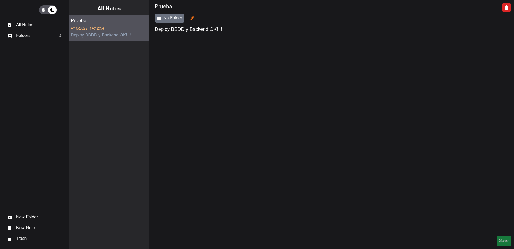
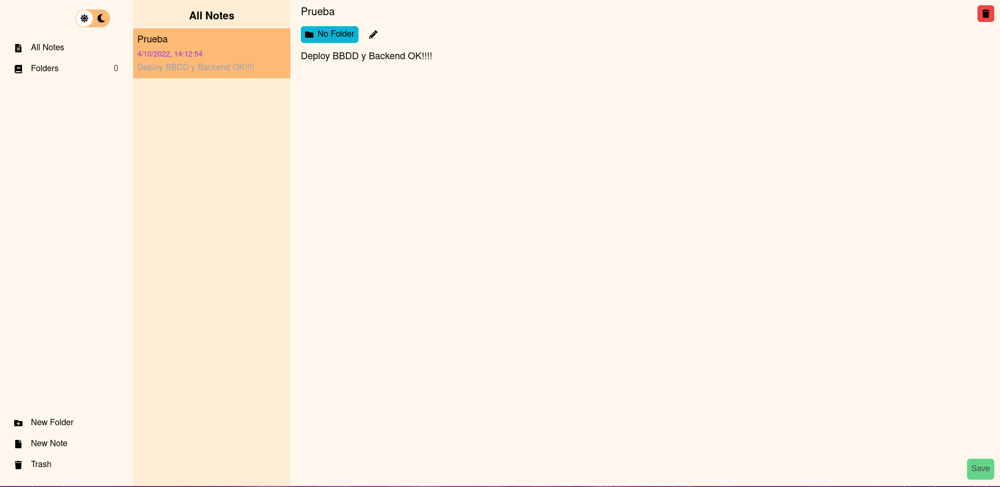

# Bloc Notes

This project consists in my personal bloc notes.

## Technologies

### Frontend


### Backend


### Other


## Structure

```
PROJECT_ROOT
├── Backend                 # Backend projecf
│   └── src                 # Folder with the data
│       ├── controllers     # Controllers files
│       ├── database        # Files with the DB connection and schemas
│       ├── services        # Services files
│       ├── tests           # Tests files
│       └── v1
│           └── routes      # Backend routes v1
└── frontend
    ├── public              # Vite.svg
    └── src                 
        ├── assets          # React.svg
        ├── components      # Folder with all the components
        ├── context         # Folder with the context file
        ├── hooks           # All the hooks of the project
        ├── services        # Services that connect with the backend
        └── pages           # Pages of the project
```


## Development

If you want to develop this project, You need to follow this steps:

    * Clone the repositorie
    * Go to the backend folder and:
        * Install the dependencies
            * npm i
        * Copy the .env.example in the .env and complete with the database information. (Recommendation: Use a mongo container in Docker)
            * If you use a mongo container, use NODE_ENV=dev
            * If you use for example MongoDB Atlas, use NODE_ENV=prod
        * Use one of this commands
            * npm start -> Better command for production or if you don't touch the backend
            * npm run dev -> If you go to modify the backend, use this command
    * Go to the frontend folder and:
        * Install the dependencies
            * yarn install
        * Copy the .env.example in your .env and complete with the url of the backend
        * Use npm run dev for start with the development


## Preview

### Dark Mode



### Light Mode



## License

MIT License.

You can create your own bloc notes application by forking this project with this conditions:

* Add a link to my [portfolio](https://arnaizdev.com)

Check out [License](./License.md) for more detail.


## Future features

- Create a new field in the Note schema (status: {"active" - "trash"}) for delete a Note but send in a trash. In trash you can delete permanently.

